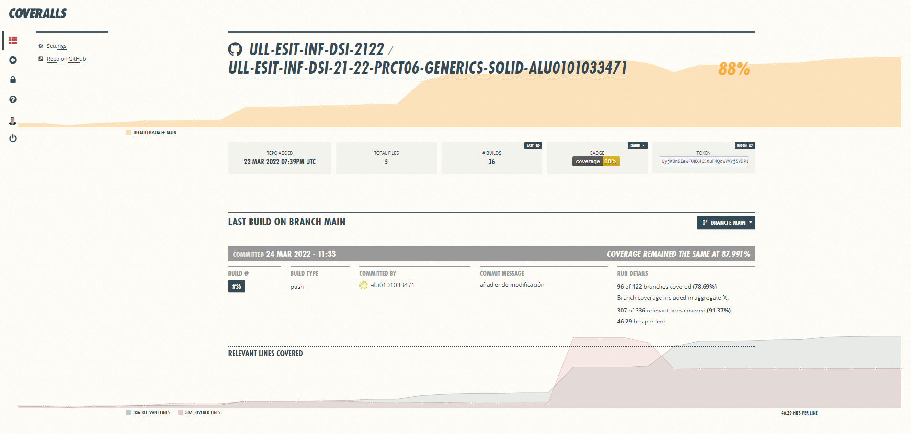

# Práctica 6 - Clases e interfaces genéricas. Principios SOLID
## Marcos Jesús Santana Ramos
### alu0101033471

Por favor clicar en el estado del coverage para ver el porcentaje real.

#### Enlace a la página publicada [Práctica 6 DSI](https://ull-esit-inf-dsi-2122.github.io/ull-esit-inf-dsi-21-22-prct06-generics-solid-alu0101033471/)
#### Informe de la actividad desarrollado en el archivo [index.md](https://github.com/ULL-ESIT-INF-DSI-2122/ull-esit-inf-dsi-21-22-prct06-generics-solid-alu0101033471/blob/main/index.md)
