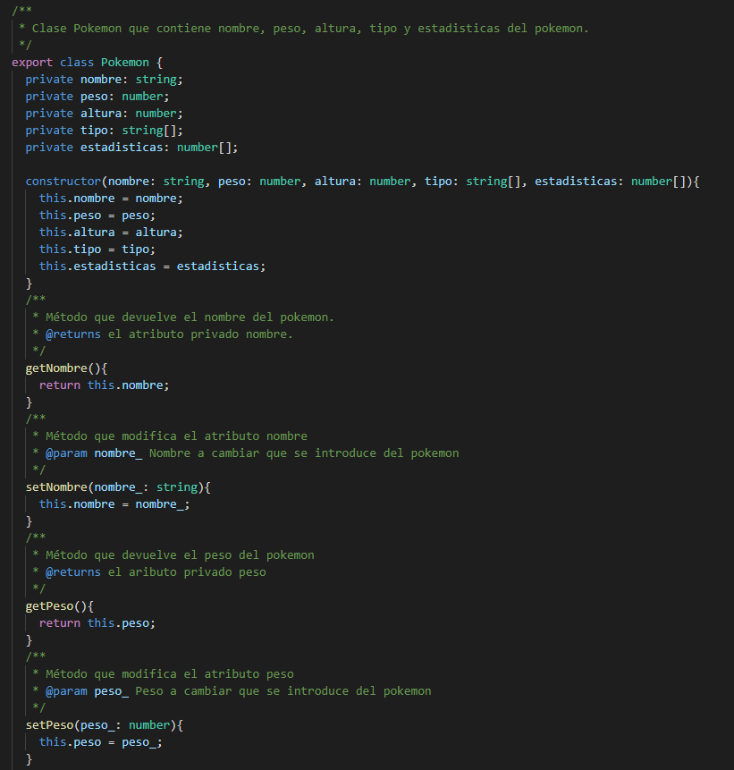
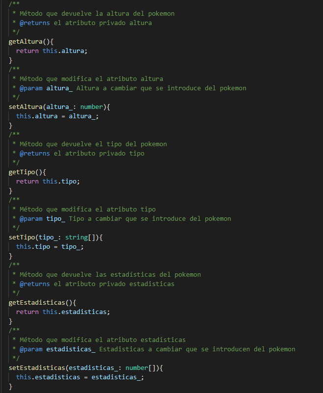
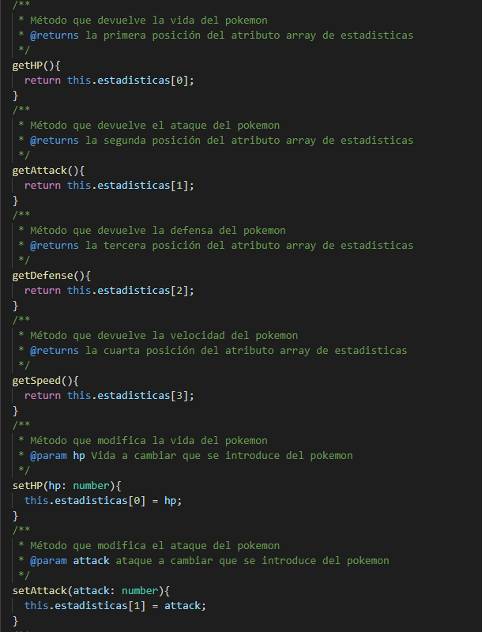
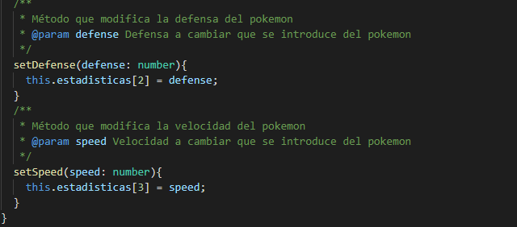
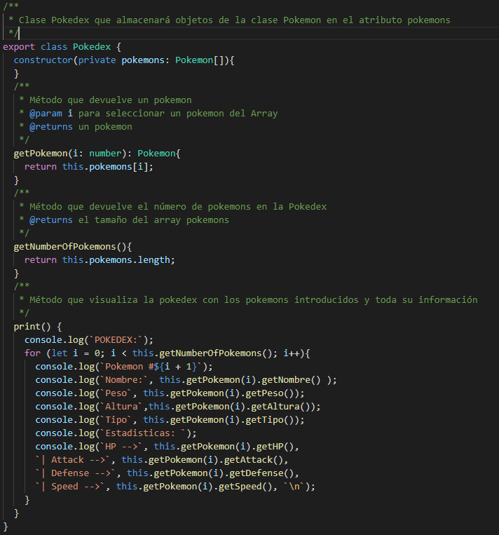

# Informe de la actividad
Práctica que permite conocer más en profundidad los objetos,clases e interfaces en ***TypeScript***. 
Para ello se llevó a cabo los siguientes ejericios.

## Ejercicio 1 - Pokedex
El objetivo de este ejercicio es crear una **Pokedex** que almacene información de distintos Pokemons. Además, el diseño de una clase **Combat** que simule el combate entre dos Pokemons. 

### Estructura
Para el siguiente ejercicio se optó por el desarrollo de una clase **Pokemon** que almacenase en atributos privados la información del Pokemon y tuviese sus respectivos métodos **set** y **get** de cada atributo. También, una clase **Pokedex** que se construye a partir de objetos de la clase **Pokemon** y en la cual como método principal, la visualización  de la información de los Pokemons añadidos a dicha Pokedex. Finalmente, la clase **Combat** con las características que pide la documentación del ejercicio.

### Código
#### Clase Pokemon

La clase **Pokemon** tiene los siguientes atributos privados:
* **nombre** almacena el nombre del Pokemon.
* **peso** almacena el peso del Pokemon.
* **altura** almacena la altura del pokemon.
* **tipo** almacena como array de string el tipo de un Pokemon ya que un Pokemon puede tener hasta dos tipos. Aunque para este ejercicio solo se ha usado el primer tipo.
* **estadisticas** almacena como array de number la vida, el ataque, la defensa y la velocidad del Pokemon.

Además de los **get** y **set** de cada atributo, también se añadieron los **get** y **set** para las estadisticas vida, ataque, defensa y velocidad.

#### Clase Pokedex

La clase **pokedex** tiene como atributo privado **pokemons**, que corresponde con un array del tipo de clase **Pokemon**.
Los tres métodos que contiene la clase son:
* **getPokemon** para devolver un Pokemon en concreto de el array **pokemons**.
* **getNumberOfPokemons** para devolver el tamaño del array **pokemons** y asi saber cuantos Pokemons hay en la Pokedex.
* **print** para visualizar la información de los Pokemons.

El método **print** realiza un bucle **for** llamando al método **getNumberOfPokemons** y asi realizar tantas iteraciones como Pokemons en la Pokedex. En dicho bucle, se va llamando en cada iteración al método **getPokemon** y al método **get** de cada atributo y estadistica de la clase **Pokemon**.

Gracias a las dos clases **Pokemon** y **Pokedex** se puede representar corrrectamente la información de distintos pokemons.

