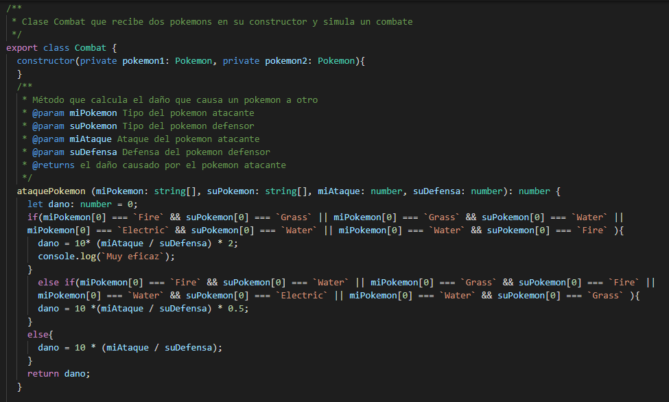
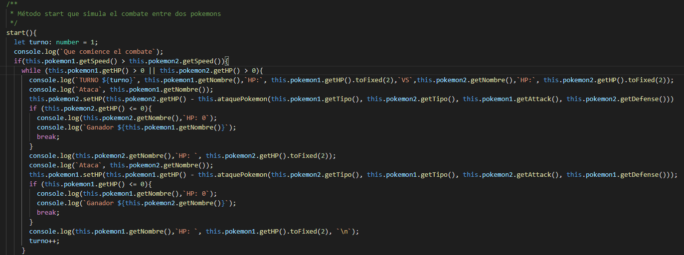
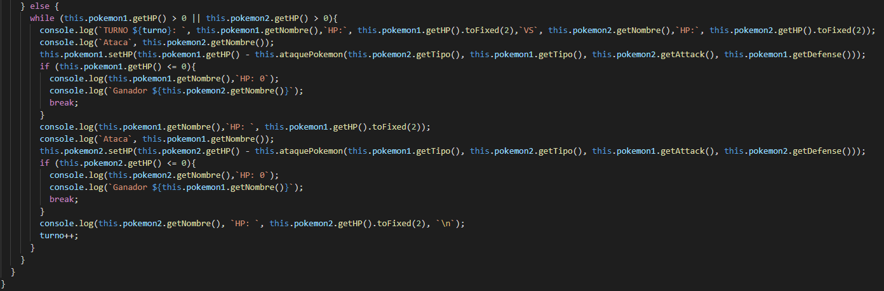
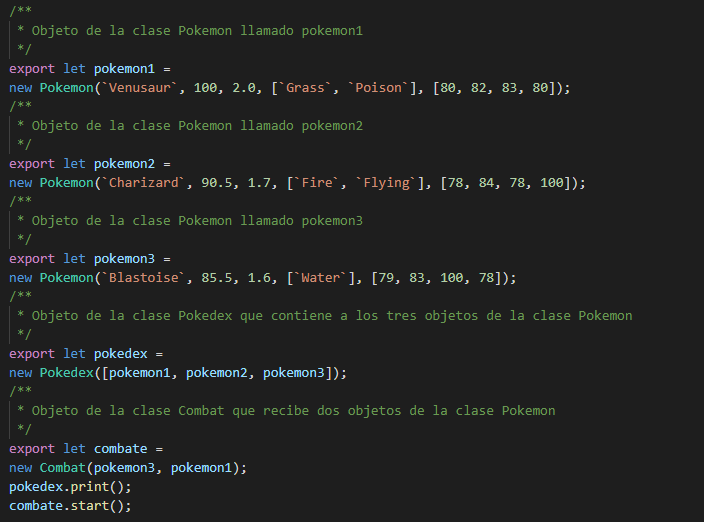
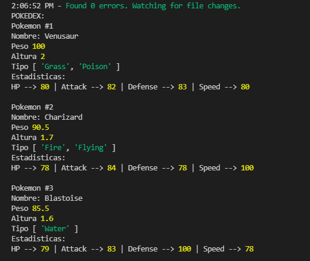
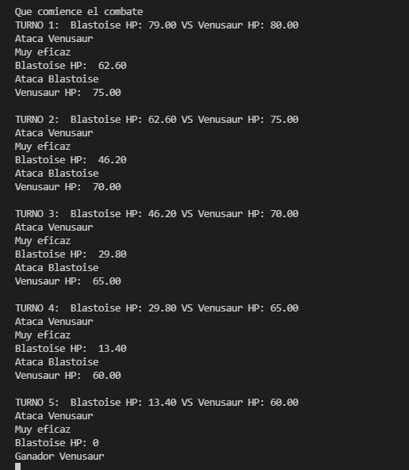

# Informe de la actividad
Práctica que permite conocer más en profundidad los objetos,clases e interfaces en ***TypeScript***. 
Para ello se llevó a cabo los siguientes ejericios.

## Ejercicio 1 - Pokedex
El objetivo de este ejercicio es crear una **Pokedex** que almacene información de distintos Pokemons. Además, el diseño de una clase **Combat** que simule el combate entre dos Pokemons. 

### Estructura
Para el siguiente ejercicio se optó por el desarrollo de una clase **Pokemon** que almacenase en atributos privados la información del Pokemon y tuviese sus respectivos métodos **set** y **get** de cada atributo. También, una clase **Pokedex** que se construye a partir de objetos de la clase **Pokemon** y en la cual como método principal, la visualización  de la información de los Pokemons añadidos a dicha Pokedex. Finalmente, la clase **Combat** con las características que pide la documentación del ejercicio.

### Código
#### Clase Pokemon

La clase **Pokemon** tiene los siguientes atributos privados:
* **nombre** almacena el nombre del Pokemon.
* **peso** almacena el peso del Pokemon.
* **altura** almacena la altura del pokemon.
* **tipo** almacena como array de string el tipo de un Pokemon ya que un Pokemon puede tener hasta dos tipos. Aunque para este ejercicio solo se ha usado el primer tipo.
* **estadisticas** almacena como array de number la vida, el ataque, la defensa y la velocidad del Pokemon.

Además de los **get** y **set** de cada atributo, también se añadieron los **get** y **set** para las estadisticas vida, ataque, defensa y velocidad.

#### Clase Pokedex

La clase **pokedex** tiene como atributo privado **pokemons**, que corresponde con un array del tipo de clase **Pokemon**.
Los tres métodos que contiene la clase son:
* **getPokemon** para devolver un Pokemon en concreto de el array **pokemons**.
* **getNumberOfPokemons** para devolver el tamaño del array **pokemons** y asi saber cuantos Pokemons hay en la Pokedex.
* **print** para visualizar la información de los Pokemons.

El método **print** realiza un bucle **for** llamando al método **getNumberOfPokemons** y asi realizar tantas iteraciones como Pokemons en la Pokedex. En dicho bucle, se va llamando en cada iteración al método **getPokemon** y al método **get** de cada atributo y estadistica de la clase **Pokemon**.

Gracias a las dos clases **Pokemon** y **Pokedex** se puede representar corrrectamente la información de distintos Pokemons.

#### Clase Combat

La clase **Combat** tiene como atributos a **pokemon1** y **pokemon2** que son de tipo de la clase **Pokemon**.
El método **ataquePokemon** corresponde con el metodo reciclado de una práctica anterior en el cual se le pasan por paramétro el tipo de un Pokemon atacante y el del defensor, el ataque del Pokemon atacante y la defensa del Pokemon defensor. Dependiendo del tipo de Pokemon el daño que inflige el Pokemon atacante varia entre ser muy eficaz y duplicar el daño, ser poco eficaz y dividir el daño a la mitad o ser neutro y el daño normal. Como se comentó anteriormente, los Pokemons pueden tener dos tipos, para haber hecho este método más interesante se podría modificar este método de tal manera que se compruebe ambos tipos de cada Pokemon y tener más condicionales que modifiquen el daño que causa.

El método **Start** simula un combate entre los dos Pokemons que se pasan por parametro a la hora de crear un objeto de la clase **Combat**. En el guión de la práctica se pedía que atacase el pokemon que primero era invocado en el constructor, sin embargo, para ser más fiel a Pokemon y darle uso a la estadística **Speed**(Velocidad), se decidió basar los turnos del combate en relacion a la **Speed** de ambos Pokemon. 
El método comienza con un condicional para saber que Pokemons es más rápido y saber que camino del código tomar. 
En el caso de que el Pokemon1 sea más rapido que el Pokemon2, se realiza un bucle **while** mientras la vida de uno de los dos Pokemons no llegue a 0. Se muestra por consola el turno, nombre y vida de ambos Pokemons y se ejecuta un ataque accediendo al método **setHP** en el cual se le pasa el método **getHP** para saber la vida y restarle el daño causado con el método **ataquePokemon**. Si el Pokemon no acaba con la vida a 0, el siguiente Pokemon atacará repitiendo este proceso hasta que uno de los dos acabe a 0 y se de por vencedor al contrincante.
En el caso de que el Pokemon2 sea más rápido que el Pokemon1, se repite el mismo proceso que en el caso anterior pero con los turnos cambiados.

#### Objetos y llamadas a métodos

Para este ejercicio se crearon tres objetos de la clase **Pokemon** y se creo uun objeto de la clase **Pokedex** con los tres objetos creados anteriormente. También, se añadió un objeto de la clase **Combat** pasándole por parámetro dos objetos de la clase **Pokemon**. Finalmente, se ejecutan los métodos **print** en el objeto de la clase **Pokedex** para visualizar la información de la Pokedex y el método **start** que simula el combate del objeto de la clase **Combat**.

### Resultados
#### Resultado Pokedex

#### Resultado Combate

